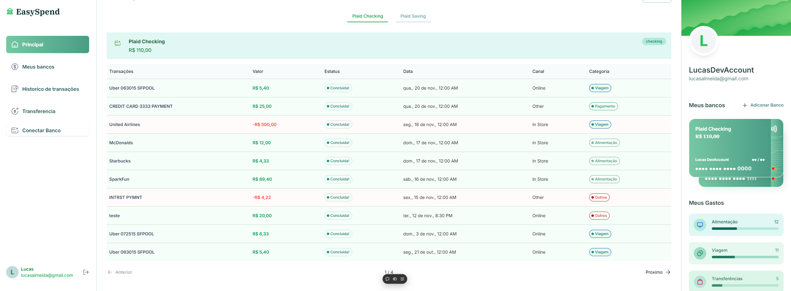
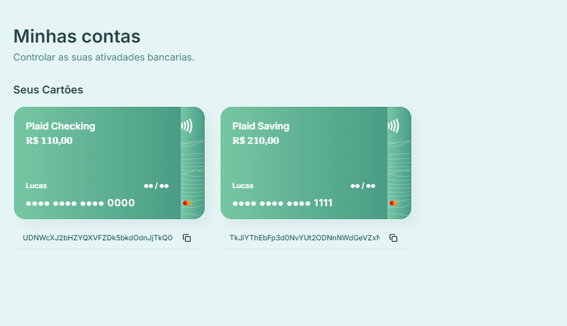
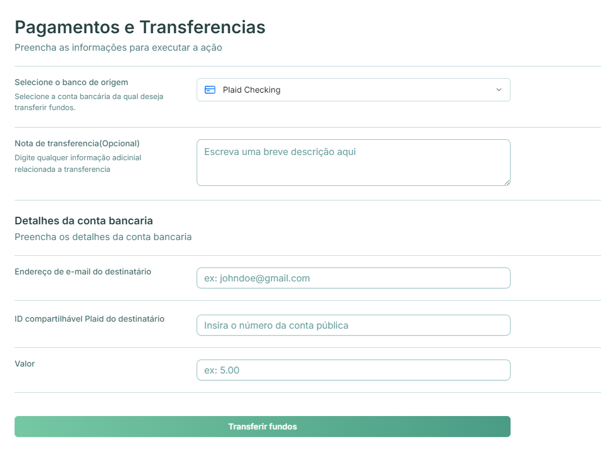

# EasySpend

**EasySpend** é uma plataforma intuitiva de controle financeiro, desenvolvida para ajudar você a gerenciar suas finanças pessoais de forma simples e eficiente.No momento, essa plataforma não está apta para usar bancos reais; apenas o modo sandbox está habilitado para que você consiga experienciar a aplicação.

## 🌟 Funcionalidades principais
- **Gestão de transações**: Adicione, edite e remova transações financeiras.
- **Visualização de categorias**: Analise seus gastos organizados por categorias.
- **Acompanhamento de progresso**: Gráficos e indicadores mostram o quanto foi gasto em relação ao orçamento.
- **Sincronização bancária**: Integração com instituições financeiras para importar transações automaticamente.

---

## 🖥️ Demonstração ao vivo
Acesse a aplicação em: [EasySpend - Controle Financeiro](https://easyspend-ckdwtmjk4-lucas-projects-6c6902e1.vercel.app/sign-in)  


---

## 🚀 Tecnologias utilizadas
- **Frontend**: [React](https://reactjs.org/), [Next.js](https://nextjs.org/)
- **Backend**: [Node.Js](https://nodejs.org/pt) , [TypeScript](https://www.typescriptlang.org/)
- **Monitoramento**: [Sentry](https://sentry.io/welcome/)
- **Banco de dados**: [AppWrite](https://appwrite.io/)
- **Autenticação**: [AppWrite](https://appwrite.io/)
- **Estilização**: [TailwindCSS](https://tailwindcss.com/), [Shadcn](https://ui.shadcn.com/).
- **Integrações**: [Plaid](https://plaid.com/docs/) API Bancaria para leitura de dados bancarios e [Dwolla](https://www.dwolla.com/) API para processamentos bancarios.

---

## 🛠️ Configuração e execução local
Siga as instruções abaixo para rodar o projeto localmente:

1. Clone o repositório:
   ```bash
   git clone https://github.com/seu-usuario/easyspend.git
   cd easyspend

2. Instale as dependências
    ```bash
    npm install

3.Configure as variáveis de ambiente:

Crie um arquivo .env e adicione as seguintes variáveis:

    
    
    # NEXT
    NEXT_PUBLIC_SITE_URL=

    # APPWRITE
    NEXT_PUBLIC_APPWRITE_ENDPOINT=https://cloud.appwrite.io/v1
    NEXT_PUBLIC_APPWRITE_PROJECT=
    APPWRITE_DATABASE_ID=
    APPWRITE_USER_COLLECTION_ID=
    APPWRITE_BANK_COLLECTION_ID=
    APPWRITE_TRANSACTION_COLLECTION_ID=
    NEXT_APPWRITE_KEY=

    # PLAID
    PLAID_CLIENT_ID=
    PLAID_SECRET=
    PLAID_ENV=
    PLAID_PRODUCTS=
    PLAID_COUNTRY_CODES=

    # DWOLLA
    DWOLLA_KEY=
    DWOLLA_SECRET=
    DWOLLA_BASE_URL=https://api-sandbox.dwolla.com
    DWOLLA_ENV=sandbox

4.Inicie o servidor de desenvolvimento:

    ```bash
    npm run dev

5.Acesse a aplicação em: http://localhost:3000


## 📷 Capturas de tela





## 🤝 Contribuições

Contribuições são bem-vindas! Sinta-se à vontade para abrir issues ou enviar pull requests para novas ideias e melhorias.

1. Faça um fork do projeto.


2.Crie uma branch para sua feature:


    git checkout -b feature/nova-feature
    
3.Faça commit das suas alterações:

    git commit -m "Adiciona nova funcionalidade"

4.Envie a branch para o repositório remoto:


    git push origin feature/nova-feature

## 📜 Licença
Este projeto está licenciado sob a Licença MIT. Consulte o arquivo LICENSE para mais detalhes.

## 📧 Contato
Se você tiver dúvidas ou sugestões, entre em contato:

Email: lucasmirandaalmeida2@gmail.com


LinkedIn: https://www.linkedin.com/in/lucas-almeida-miranda/Seu LinkedIn